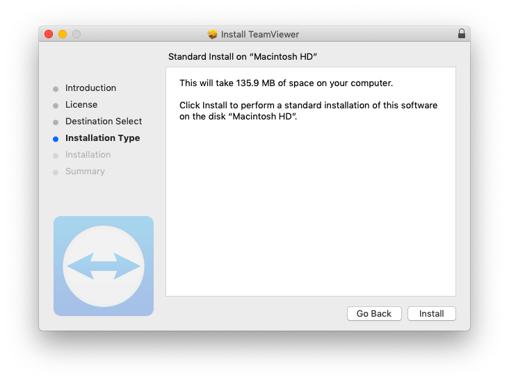
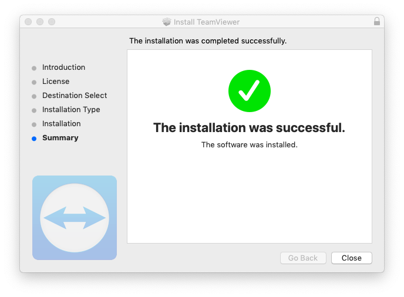
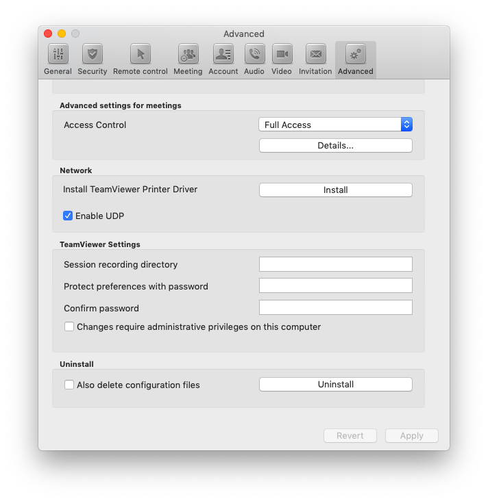

# Mac Computers

## Asking the User to Install Teamviewer

### Installing Teamviewer

The user has to first download the [Mac OS Teamviewer client](https://www.teamviewer.com/en/download/mac-os/) from the website. When the `.dmg` file is downloaded, double click on it, then double click on the icon shown on the screen to start the Installation process.

The installation process is pretty straightforward, you need to accept the license and then install TeamViewer on the computer (it should requires less than 200MB of space).

At the end of the installation process, TeamViewer start the assistant to configure access rights on the system. You can skip this part.

### Giving Full Access to Teamviewer

Once it is installed, you should see the TeamViewer window. You now need to configure access rights, go to `Help > Check system access`.

For each of these steps, you need to click on "Request Access", which opens the relevant system configuration window and let you add TeamViewer in it. For each of them, you will have to first click on the lock icon on the bottom left of the window to get admin right, and then add TeamViewer to the list of applications authorized.

Once you have done all the steps, you should see all three system settings with a green dot written "Allowed". You should now quit TeamViewer and launch it when needed.

## Connecting to the User Computer

To connect to the user computer, you have to ask them to give you their id (a 10 digit number) and a password (a six character string including letters and numbers). Enter the user id in the `Control Remote Computer` part, and enter the password when asked for it.

### Transferring Files

You should now have Teamviewer connected. The first step is to copy all the programs you need for this check using the File Transfer tool. Go to the navigation bar at the top and click on `Open File Transfer` under `Files & Extras`. You should create a temporary folder, and then transfer all the needed programs from your computer, by selecting them and clicking on `Send`.

### Checking the computer

Once the programs are all transferred, you can proceed with the standard checks as described in the [Mac OS](mac.md) part of this guide. Please keep in mind that the connection may be slow and it can take more time than usual.

## Uninstalling Teamviewer

Once the check is done, the user should uninstall TeamViewer. To do that, they have to open the app, go to the page `TeamViewer > Preferences`, go the the `Advanced` tab and go to the bottom of the page in the `Uninstall section`. Click on `Also delete configuration files` and click on Uninstall.

