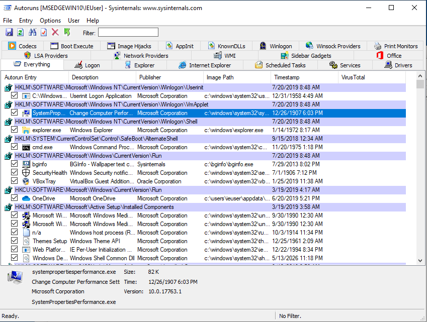

# فحص البرامج التي تبدأ مع تمهيد تشغيل الكمبيوتر

عادة تحتاج برمجيات التجسس إلى طريقة لتبدأ مع تمهيد التشغيل عند إعادة تشغيل الكمبيوتر. وبالتالي فإن البحث في التطبيقات التي تبدأ تلقائيًا هي إحدى أولى عمليات الفحص التي يجب إجراؤها عند التحقيق في وجود إصابة محتملة، علمًا أن أجهزة الكمبيوتر التي تعمل بنظام ويندوز تشمل عدة طرق مختلفة لتمكين التشغيل التلقائي وغالبًا ما تستخدم برمجيات التجسس الخداع لتبدو سليمة و/أو لتتجنب الطرق الأكثر شيوعًا.

تسمح أداة [سيسينترنال أتورانز](https://technet.microsoft.com/en-ca/sysinternals/bb963902.aspx) بسرد جميع البرامج التي تعمل عند بدء التشغيل بشكل شامل، وإذا كان ذلك ممكنًا، عليك تشغيل هذا البرنامج بصفة مسؤول:

ستظهر جميع النتائج افتراضيًا في علامة التبويب الرئيسية، وسيسمح النقر على علامات التبويب الأخرى المتاحة إلى تصفية النتائج لتظهر النوع تلقائي التشغيل. والعناصر الأكثر أهمية بشكل عام هي `تسجيل الدخول (Logon)` و`المهام المجدولة (Scheduled Tasks)` و`الخدمات (Services)`.

## البحث عن أنماط مشبوهة

لا يدل أتورانز بحد ذاته على ما إذا كان ملف ما ضارًا أم لا، وكما هو الحال مع بقية هذه المنهجية، من الضروري في النهاية أن تعرف نتائجه إلى حد يكفي لتمكينك بسرعة من الكشف عن أي حالات شاذة أو إدخالات لا تتعرف عليها. ولكن يمكن أن يوفر أتورانز بعض المؤشرات المفيدة.

في بعض الأحيان قد يشير أتورانز إلى صف معين بخلفية حمراء، ويدل ذلك على الحاجة إلى التحقيق فيه لأنه قد يكون علامة على إدخال غير عادي. تشير الإدخالات ذات الخلفية الصفراء بدلًا من ذلك إلى ملفات لم تعد موجودة على الكمبيوتر، وهذا يعني أن الإدخالات معطلة.

فيما يلي بعض الاقتراحات حول الأنماط التي يجب الانتباه إليها:

### 1\. تحقق من التوقيع الرقمي للصور

في الإصدارات الحديثة من ويندوز يُطلب عمومًا أن تكون التطبيقات السليمة تتمتع "بتوقيع رقمي" بموجب شهادة مطور، وتسمح هذه الشهادات بالتحقق من منتج برنامج معين (مثل مايكروسوفت أو جوجل (Google) أو أدوبي (Adobe) أو غير ذلك). تخضع التطبيقات التي لا تتمتع بتوقيع طبيعي للضبط والتدقيق من قبل آليات أمان ويندوز (مثل برنامج مكافحة الفيروسات المضمّن ويندوز ديفيندر (Windows Defender)). من المفيد كفحص أولي التحقق مما إذا كانت جميع التطبيقات التي يتم تشغيلها تلقائيًا موقعة بالفعل ويمكن القيام بذلك عن طريق النقر على _Options (خيارات)_\\> _Scan Options (خيارات المسح)_ وتمكين _التحقق من التواقيع الرقمية للتعليمات البرمجية (Verify code signatures)_.

سيؤدي هذا إلى إعادة تشغيل فحص أتورانز وإضافة عمود جديد يسمى "Publisher" (الناشر). وستظهر على الطلبات الموقعة بشكل صحيح علامة تدل أنه "Verified" (تم التحقق منها):

**يرجى توخي الحذر**: ليست جميع إدخالات Autorun التي تم التحقق منها آمنة بالضرورة، ولكن في بعض الأحيان يقوم المهاجمون باستغلال التطبيقات المشروعة التي تم التحقق منها كي يجذبوا شكوكًا أقل ويستخدمونها كمشغلات لتحميل التعليمات البرمجية الضارة وتنفيذها. يتم ذلك أحيانًا باستخدام، على سبيل المثال، مايكروسوفت` rundll32.exe` أو التطبيقات الأخرى المتأثرة بما يعرف بالتحميل الجانبي [(DLL Sideloading)](https://attack.mitre.org/techniques/T1073/).

### 2\. تحقَّق من اسم إدخال Autorun

يعرض إدخال Autorun الاسم الذي تم إعطاؤه للتطبيق من قبل مطوريه، ويمكن تزييف هذه المعلومات ولكن في بعض الأحيان يكون المهاجمون كسولين إلى حد إساءة تهجئة الأسماء المشروعة المزيفة (على سبيل المثال "Micorsoft Ofice" أو "Crhome") أو مجرد استخدام الأحرف والأرقام العشوائية.

### 3\. التحقق من وصف البرنامج

وبالمثل، ليس هذا مؤشرًا موثوقًا به ويجب أن تحتوي التطبيقات المشروعة عمومًا على وصف برنامج مرئي.

### 4\. تحقق من مسار الصورة

يوفر ويندوز بعض المجلدات القياسية التي عادةً ما تُثبت وتُشغل فيها التطبيقات السليمة. عادةً ما تتواجد خدمات نظام التشغيل نفسه في `C:\Windows\`، بينما تتواجد التطبيقات المثبتة بواسطة المستخدم بشكل عام في `C:\Program Files\` أو `C:\Program Files (x86)\`. نظرًا لأن تثبيت البرامج في تلك المجلدات يجب أن يتطلب بعض التأكيد من المستخدم، فغالبًا ما يضع المهاجمون ملفاتهم الضارة في مجلدات أقل نموذجية، مثل ` C:\Users\<Username>\AppData\` أو مجلدات فرعية أخرى في `C:\Users\`.

مثال على الإدخالات المشبوهة:

* تنشئ [برمجية تجسس KeyBoy](https://citizenlab.ca/2016/11/parliament-keyboy/) مفتاح تسجيل في `HKEY_CURRENT_USER\SOFTWARE\Microsoft\Windows NT\CurrentVersion\Winlogon\shell` بالقيمة `explorer.exe,C:\Windows\system32\rundll32.exe "%LOCALAPPDATA%\cfs.dal" cfsUpdate.`
    
* تعتمد برمجية ضارة معينة مستخدمة في آسيا الوسطى على استخدام VBScripts التي يبرزها أوتورانز بخلفية حمراء وتتظاهر بأنها برنامج أدوبي وجوجل ومن المؤكد أن هذه النتائج تستدعي تحقيقًا إضافيًا. بالإضافة إلى ذلك تقع البرمجيات النصية في `C:\Users\<Username>\AppData\`:
    

### اختياري: 5\. فحص البرامج على فيروس توتال (VirusTotal)

يسمح أتورانز اختياريًا بالتحقق من الملفات الثنائية مقابل [فيروس توتال](https://www.virustotal.com/gui/home/upload) مما يساعد على تحديد أي برنامج ضار معروف جيدًا ويتم كشفه على نطاق واسع بواسطة برنامج مكافحة الفيروسات (اقرأ المزيد حول هذا في القسم أدناه). لتمكين هذا التحقق، انتقل إلى_Options (خيارات)_ \\> _Scan Options (خيارات المسح)_ وقم بتمكين "_Check VirusTotal.com (التحقق على VirusTotal.com)_". احرص على عدم تمكين "_ إرسال الملفات غير المعروفة (Submit Unknown Files)_"، لأنه سيجعل أتورانز يقوم تلقائيًا بتحميل الملفات المحلية إلى الخدمة بدلًا من مجرد البحث عن شفرات التجزئة التشفيرية الخاصة بها. تعد فيروس توتال شركة تملكها ألفابيت (Alphabet) (الشركة الأم لشركة جوجل) وتوفر الوصول التجاري إلى بياناتها للباحثين الأمنيين والعملاء في جميع أنحاء العالم. يمكن لأولئك الذين لديهم حق الوصول إلى خدمات فيروس توتال التجارية البحث عن أي ملف تم تحميله وتنزيله، ولذلك قد ترغب في تجنب إرسال أي ملفات قد تكون سرية دون قصد.

بمجرد تمكين خيار فيروس توتال سيستغرق ظهور النتائج بعض الوقت، وفي النهاية ستتمكن من مشاهدة عمود فيروس توتال يعرض نتائج فحص مكافحة الفيروسات. تظهر النتائج على شكل قيمة _X/Y_، حيث _X_ تعني عدد النتائج الإيجابية و_Y_ تمثل العدد الإجمالي لبرامج مكافحة الفيروسات التي استخدمت لفحص الملف.

إذا لم تظهر أي نتيجة فهذا يعني أن البرنامج المقصود لم يتم تحميله مسبقًا إلى فيروس توتال وقد يتطلب فحصًا إضافيًا، وفي بعض الأحيان سترى أن بعض التطبيقات لها رقم اكتشافات منخفض (1 أو 2)، وغالبًا ما تكون هذه نتائج إيجابية خاطئة. تُعدّ نتائج فيروس توتال التي تظهر رقم اكتشاف أعلى (على سبيل المثال، 5 وما فوق) بشكل عام علامة موثوقة على أن هذا التطبيق المعين ضار. سيؤدي النقر على الرابط المتاح في قيم _X/Y_ إلى فتح المتصفح لتحليل فيروس توتال حيث يمكنك رؤية تفاصيل إضافية مثل أي معرفات برامج برمجيات يستخدمها برنامج مكافحة الفيروسات المدعوم.

**يرجى ملاحظة أن:** [كما تمت مناقشته](https://github.com/pellaeon/guide-to-quick-forensics/blob/master/windows/safety.md) في ظل الظروف العادية من المفضل عدم توصيل الكمبيوتر الذي تم اختباره بالإنترنت، لكن دون اتصال بالإنترنت لا يمكنك التحقق على الفور من فيروس توتال. لكن من الممكن حفظ نتائج التشغيل التلقائي بالنقر على _File (ملف)_ \\> _Save... (حفظ)_ وفتح النتائج لاحقًا من جهاز كمبيوتر منفصل متصل بالإنترنت.
